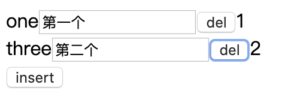
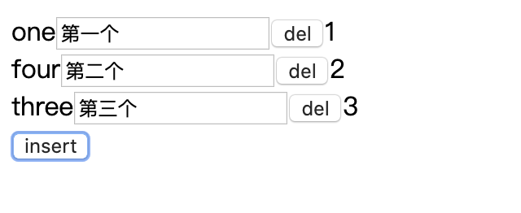
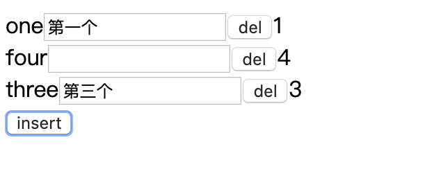

不管是Vue，还是React，key都作为一个特殊属性，那么这个属性到底有什么用呢？本文以vue为例子分析key的作用以及自己的一些思考。<!--more-->

## 困境

在一些博客中，经常会写到列表渲染要用key来区分不同列表项，而且最好不要用数组的索引作为key，因为这样会造成一些问题，推荐使用独一无二的id作为key，可以更加高效的渲染。

为什么key这个属性会有这些问题和讲究呢？如果违背了，会出现什么问题呢？

## 初识

在[vue官网文档](https://cn.vuejs.org/v2/api/#key)上说到，说到key是用在Vue的diff算法中，在新旧nodes对比时辨识vnodes，如果不实用key，vue会使用一种最大程度减少动态元素并且尽可能尝试就地修改/复用相同类型元素的算法。使用key时，会基于key的变化重新排列元素顺序。

这里有几个关键字，diff算法，对比辨识，就地复用/修改，基于key重排。在下面的深入部分将会讲到。

## 深入

先看一下代码上下文

```html
<!-- App.vue -->
<template>
  <div id="app">
    <Child v-for="(user, index) in users" :key="index" :name="user.name" @delete="del(index)"/>
    <button @click="insert">insert</button>
  </div>
</template>

<script>
import Child from "./components/Child.vue";

export default {
  name: "App",
  components: {
    Child
  },
  data() {
    return {
      users: [
        { id: 1, name: "one" },
        { id: 2, name: "two" },
        { id: 3, name: "three" }
      ]
    };
  },
  methods: {
    del(index) {
      this.users.splice(index, 1);
    },
    insert() {
      this.users.splice(1, 1, { id: 4, name: 'four' })
    }
  }
};
</script>


```


```html
<!-- Child.vue -->
<template>
  <div class="hello">
    <span>{{ name }}</span>
    <input type="text" v-model="msg">
    <button @click="handleClick">del</button>
    <span>{{ count }}</span>
  </div>
</template>

<script>
let i = 1;
export default {
  name: "Child",
  props: {
    name: String
  },
  data() {
    return {
      msg: "",
      count: i++
    };
  },
  methods: {
    handleClick() {
      this.$emit("delete");
    }
  }
};
</script>

<style>
</style>
```

可以在[codesandbox](https://codesandbox.io/s/vue-key-yd5lp)查看具体效果

之后的讨论只在上面的代码基础上修改Child组件上key的值。

首先将key绑定为下标索引值。渲染出来是没有毛病的，但是前面我们看到key作用的时间是在diff的时候，当数据发生变化的时候，vnode节点树就会重新生成，之后通过diff找到修改的地方，然后把修改的地方通过dom方法修改（diff算法可以看看[vue源码](https://github.com/vuejs/vue/blob/dev/src/core/vdom/patch.js)或者[snabbdom](https://github.com/snabbdom/snabbdom)，二者都采用了双端比较的算法，此处不讨论过多细节），所以，可以先可以在input里输入一些文字，这些文字是存在组件内部state的，然后，点击第二个Chlld的删除，此时却发现，只有外部的info显示更新了，而input里面的文字竟然没有更新



这是为什么呢？让我们回想一下当点击删除的时候发生了什么。首先是数据更新，数据更新之后会触发重新生成vnode，然后进行diff，diff完之后会修改dom。这个diff过程就是key作用的地方，两次的vnode结果大概如下

```jsx
// 前
{
	tag: 'div',
	props: {
		id: 'app'
	},
	children: [
		{
			tag: 'Child',
			key: 0,
			name: 'one'
		},
		{
			tag: 'Child',
			key: 1,
			name: 'two'
		},
		{
			tag: 'Child',
			key: 2,
			name: 'three'
		},
		{
			tag: 'button',
			children: 'insert'
		}
	]
}

// 后
{
	tag: 'div',
	props: {
		id: 'app'
	},
	children: [
		{
			tag: 'Child',
			key: 0,
			name: 'one'
		},
		{
			tag: 'Child',
			key: 1,
			name: 'three'
		},
		{
			tag: 'button',
			children: 'insert'
		}
	]
}
```

在贴一段diff的函数

```jsx
function updateChildren (parentElm, oldCh, newCh, insertedVnodeQueue, removeOnly) {
    let oldStartIdx = 0
    let newStartIdx = 0
    let oldEndIdx = oldCh.length - 1
    let oldStartVnode = oldCh[0]
    let oldEndVnode = oldCh[oldEndIdx]
    let newEndIdx = newCh.length - 1
    let newStartVnode = newCh[0]
    let newEndVnode = newCh[newEndIdx]
    let oldKeyToIdx, idxInOld, vnodeToMove, refElm

    // removeOnly is a special flag used only by <transition-group>
    // to ensure removed elements stay in correct relative positions
    // during leaving transitions
    const canMove = !removeOnly

    if (process.env.NODE_ENV !== 'production') {
      checkDuplicateKeys(newCh)
    }

    while (oldStartIdx <= oldEndIdx && newStartIdx <= newEndIdx) {
      if (isUndef(oldStartVnode)) {
        oldStartVnode = oldCh[++oldStartIdx] // Vnode has been moved left
      } else if (isUndef(oldEndVnode)) {
        oldEndVnode = oldCh[--oldEndIdx]
      } else if (sameVnode(oldStartVnode, newStartVnode)) {
        patchVnode(oldStartVnode, newStartVnode, insertedVnodeQueue, newCh, newStartIdx)
        oldStartVnode = oldCh[++oldStartIdx]
        newStartVnode = newCh[++newStartIdx]
      } else if (sameVnode(oldEndVnode, newEndVnode)) {
        patchVnode(oldEndVnode, newEndVnode, insertedVnodeQueue, newCh, newEndIdx)
        oldEndVnode = oldCh[--oldEndIdx]
        newEndVnode = newCh[--newEndIdx]
      } else if (sameVnode(oldStartVnode, newEndVnode)) { // Vnode moved right
        patchVnode(oldStartVnode, newEndVnode, insertedVnodeQueue, newCh, newEndIdx)
        canMove && nodeOps.insertBefore(parentElm, oldStartVnode.elm, nodeOps.nextSibling(oldEndVnode.elm))
        oldStartVnode = oldCh[++oldStartIdx]
        newEndVnode = newCh[--newEndIdx]
      } else if (sameVnode(oldEndVnode, newStartVnode)) { // Vnode moved left
        patchVnode(oldEndVnode, newStartVnode, insertedVnodeQueue, newCh, newStartIdx)
        canMove && nodeOps.insertBefore(parentElm, oldEndVnode.elm, oldStartVnode.elm)
        oldEndVnode = oldCh[--oldEndIdx]
        newStartVnode = newCh[++newStartIdx]
      } else {
        if (isUndef(oldKeyToIdx)) oldKeyToIdx = createKeyToOldIdx(oldCh, oldStartIdx, oldEndIdx)
        idxInOld = isDef(newStartVnode.key)
          ? oldKeyToIdx[newStartVnode.key]
          : findIdxInOld(newStartVnode, oldCh, oldStartIdx, oldEndIdx)
        if (isUndef(idxInOld)) { // New element
          createElm(newStartVnode, insertedVnodeQueue, parentElm, oldStartVnode.elm, false, newCh, newStartIdx)
        } else {
          vnodeToMove = oldCh[idxInOld]
          if (sameVnode(vnodeToMove, newStartVnode)) {
            patchVnode(vnodeToMove, newStartVnode, insertedVnodeQueue, newCh, newStartIdx)
            oldCh[idxInOld] = undefined
            canMove && nodeOps.insertBefore(parentElm, vnodeToMove.elm, oldStartVnode.elm)
          } else {
            // same key but different element. treat as new element
            createElm(newStartVnode, insertedVnodeQueue, parentElm, oldStartVnode.elm, false, newCh, newStartIdx)
          }
        }
        newStartVnode = newCh[++newStartIdx]
      }
    }
    if (oldStartIdx > oldEndIdx) {
      refElm = isUndef(newCh[newEndIdx + 1]) ? null : newCh[newEndIdx + 1].elm
      addVnodes(parentElm, refElm, newCh, newStartIdx, newEndIdx, insertedVnodeQueue)
    } else if (newStartIdx > newEndIdx) {
      removeVnodes(oldCh, oldStartIdx, oldEndIdx)
    }
  }
```

这里的关键点在于sameVnode的实现，它决定了是复用元素还是根据vnode创建元素。

```jsx
function sameVnode (a, b) {
  return (
    a.key === b.key && (
      (
        a.tag === b.tag &&
        a.isComment === b.isComment &&
        isDef(a.data) === isDef(b.data) &&
        sameInputType(a, b)
      ) || (
        isTrue(a.isAsyncPlaceholder) &&
        a.asyncFactory === b.asyncFactory &&
        isUndef(b.asyncFactory.error)
      )
    )
  )
}
```

看到这里，应该可以知道，前后两次vnode的第二个Child节点，由于tag一样，key都是1，所以这里会复用原来的组件实例，然后调用patchVnode去更新，比如这里就是新vnode与旧版的vnode的name不一样，这些将会通过更新来实现。至于为什么input输入框里的内容没有变，原因是Child组件被复用了，input里的内容受到组件内部state的影响，既然组件没有被销毁，那么就说明了state没有被修改，**这种情况的复用和修改一个组件的props效果是一样的，这也就是文档上所说的就地复用/修改**。

其实还可以通过count来观察到组件是否是新建的实例，每新建一个实例count就会加1，而key为index，删除了第二条元素，发现最后面的count还是之前的2。这说明了这个Child实例就是之前三个user渲染出来的第二项。

如果key是user.id的话，删除任意一个元素，sameVnode由于key不相等，不会想之前那样简单复用了，而是根据key去找在旧的children里与当前key相等的元素进行复用，找不到就会创建新的实例，这种情况input 和 后面的count都准确渲染了


如果不传key，每次sameVnode中比较`undefined === undefined`都是成立的，复用也会出现前面说到的和使用索引作为key一样的问题。

按照上面的分析，可以很快的分析出插入时候的情况。插入是将第二个删除，插入第四个。

```js
insert() {
	this.users.splice(1, 1, { id: 4, name: 'four' })
}
```

使用索引作为key时，



使用user.id作为key时



可以看到这里count增加了，说明是创建了新的实例。
